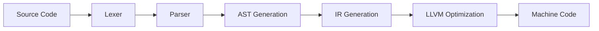

# 🌿 sleaf-llvm
<a id="readme-top"></a>

<div align="center">
  <!--  -->

  <h3>System programming language made with C++ &amp; LLVM</h3>

  <div align="center">
    <a href="https://marketplace.visualstudio.com/items?itemName=alexeevdev.sleaf-llvmuage-syntax">
      	
    </a>
    <a href="https://alexeev-prog.github.io/sleaf-llvm/">
		
    </a>
  </div>
</div>

<br>

<div align="center">
  
  
  
  
  <a href="https://github.com/alexeev-prog/sleaf-llvm/stargazers">
        
  </a>
  
  
</div>

<div align="center" style="margin: 15px 0">
  
  
</div>

<div align="center">
  
</div>

> [!CAUTION]
> SLEAF is currently in active alpha development. While core functionality is stable, some advanced features are still evolving. Production use requires thorough testing.

## 🚀 Technical Overview
sleaf-llvm is a statically-typed systems programming language compiler targeting LLVM IR. The implementation provides:

- **LLVM 19 Backend**: Direct IR generation via C++ API
- **Modern C++20 Codebase**: Leveraging metaprogramming and template features
- **Cross-Platform Support**: Generates binaries for Windows/Linux/macOS
- **Modular Architecture**: Separated lexer/parser/IR generation components

> **Current Status**: Alpha development (v0.1.0). Core compilation pipeline functional. Not production-ready.



### Examples

#### Hello World

```sleaf
// SLEAF example code
func main() -> i32 {
    const string hello = "Hello, World!";

    printf("%s\n", hello);
    return 0;
}
```

## 📦 Installation & Usage

### System Requirements

| Component       | Minimum Version | Notes                          |
|-----------------|-----------------|--------------------------------|
| LLVM            | 19.x            | Development libraries required |
| Clang           | 15.0+           | C++20 support mandatory        |
| CMake           | 3.20+           | Build system                   |
| Python          | 3.8+            | Scripting utilities            |

### Build Instructions
```bash
# Clone repository with submodules
git clone --recurse-submodules https://github.com/alexeev-prog/sleaf-llvm.git
cd sleaf-llvm

# Build full project
./build.sh all

./build/bin/sleafllvm -h
```

### How To Use
Please, build and install lib. [Instruction here](./BUILDING.md).

You also can read [Hacking](./HACKING.md)

### Core Technical Features
| Feature | Technical Implementation | Performance Impact |
|---------|---------------------------|---------------------|
| **LLVM19 Backend** | Direct LLVM IR generation via C++ API | Near-native execution speed, advanced optimizations |
| **Cross-Platform** | Single IR → Windows/Linux/macOS binaries | Consistent behavior across platforms |

## Plans

 - [x] Lexer
 - [x] Parser
 - [x] AST
 - [x] Codegen
   - [x] Basic Codegen
   - [x] Variables, const, create and set, types.
   - [ ] Export printf function
   - [ ] `if-then-else` branches
   - [ ] `while` and `loop` cycles
   - [ ] `for` cycles
   - [ ] `break`, `continue` keywords
   - [ ] `if-elif-else` conditions
   - [ ] `struct` support
   - [ ] `import` and modules
 - [ ] VSCode Extension
 - [ ] Standard library
 - [ ] Package manager

## SLEAF Manifesto
*"We reject the false choice between performance and expressiveness.
We reject the old methods imposed by backward compatibility with
long-dead legacy products. SLEAF is a new era in researching programming
that combines the simplicity of classic C-syntax with the functionality
of C/C++. Thanks to the purity of the project and its versatility,
you can create anything and everything you want."*

## Contributing

We welcome contributions! Please see [CONTRIBUTING.md](CONTRIBUTING.md) for guidelines. Key areas for contribution include:
- Additional test cases for thread-local scenarios
- Performance optimization proposals
- Extended version format support
- IDE integration plugins

### Contribution Guidelines
1. **Issue Tracking** - Report bugs via GitHub Issues
2. **Pull Requests** - Follow [CONTRIBUTING.md](CONTRIBUTING.md)
3. **Code Standards** - Adhere to specifications
4. **Performance** - Validate changes with benchmarks
5. **Documentation** - Update relevant documentation

## License & Support

This project is licensed under **GNU GPL 3.0 License** - see [LICENSE](https://github.com/alexeev-prog/sleaf-llvm/blob/main/LICENSE). For commercial support and enterprise features, contact [alexeev.dev@mail.ru](mailto:alexeev.dev@mail.ru).

[Explore Documentation](https://alexeev-prog.github.io/sleaf-llvm) |
[Report Issue](https://github.com/alexeev-prog/sleaf-llvm/issues) |
[View Examples](./examples)

### ⚖️ License
```text
System programming language made with C++ &amp; LLVM
Copyright (C) 2025 Alexeev Bronislav

This program is free software: you can redistribute it and/or modify
it under the terms of the GNU General Public License as published by
the Free Software Foundation, either version 3 of the License, or
(at your option) any later version.

This program is distributed in the hope that it will be useful,
but WITHOUT ANY WARRANTY; without even the implied warranty of
MERCHANTABILITY or FITNESS FOR A PARTICULAR PURPOSE. See the
GNU General Public License for more details.

You should have received a copy of the GNU General Public License
along with this program. If not, see <https://www.gnu.org/licenses/>.
```

---

<div align="center">
  <br>
  <p>Copyright © 2025 Alexeev Bronislav. Distributed under GNU GPL 3 license</p>
  <a href="#readme-top">↑ Back to Top ↑</a>
  <br>
  <sub>Made with LLVM 19</sub>
</div>
