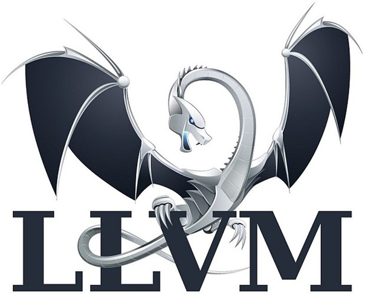
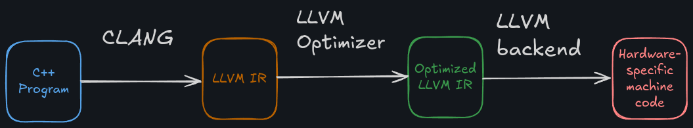

LLVM - это целый набор инструментов для создании и оптимизации компиляторов. Он позволяет даже создавать языки программирования с нуля.

LLVM берет на себя сложный процесс преобразования исходного кода в машинный код.

 > LLVM создан в 2003 году аспирантом Крисом Латтнером. В настоящий день LLVM используется для Rust, Swift, Julia.

Самое главное, чем занимается LLVM - это превращение исходного кода высокого уровня в код, который не зависит от языка, называемый [[1.2 IR]].

Это означает, что совершенно два разных языка - например Cuda и Ruby - создают один и тот же код IR, что позволяет им использовать инструменты анализа и оптимизации от LLVM, прежде чем они будут преобразованы в машинный код конкретной архитектуры.

Он разделяет стадии компиляции (описаны в [[1.3 Устройство компилятора]]) на модулярные многоразовые компоненты.

Эта модулярность делает LLVM изменяемым и расширяемым для различных использований, например [[1.1.1 JIT Compiler]].

