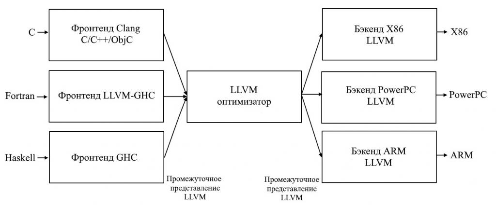

Главной особенностью LLVM является промежуточное представление кода (англ. Intermediate Representation, IR), форма, которую использует LLVM для представления кода в компиляторе. LLVM IR был разработан для выполнения функций промежуточного анализа и преобразований внутри оптимизатора компилятора. Ее создание имело целью решение множества специализированных задач, включая поддержку легковесных оптимизаций среды выполнения, кроссфункциональные и межпроцедурные оптимизации, полный анализ программы и агрессивные реструктурирующие преобразования. Промежуточное представление кода определено как язык первого порядка с четкой семантикой.

**IR (Intermediate Representation) в контексте LLVM — это промежуточное представление кода**. Это низкоуровневое, независимое от платформы и типобезопасное представление программного кода, которое используется в качестве промежуточного языка между интерфейсной частью и серверной частью компилятора.

```
define i32 @add1(i32 %a, i32 %b) {
entry:
  %tmp1 = add i32 %a, %b
  ret i32 %tmp1
}

define i32 @add2(i32 %a, i32 %b) {
entry:
  %tmp1 = icmp eq i32 %a, 0
  br i1 %tmp1, label %done, label %recurse

recurse:
  %tmp2 = sub i32 %a, 1
  %tmp3 = add i32 %b, 1
  %tmp4 = call i32 @add2(i32 %tmp2, i32 %tmp3)
  ret i32 %tmp4

done:
  ret i32 %b
}
```

Этот код LLVM IR соответствует следующему коду на языке C, обеспечивающему возможность сложения целых чисел двумя разными способами:

```c
unsigned add1(unsigned a, unsigned b) {
	return a+b;
}
// возможно не самый лучший способ сложения двух чисел

unsigned add2(unsigned a, unsigned b) {
	if (a == 0) return b;
	return add2(a-1, b+1);
}
```

Как видно из этого примера, LLVM IR — низкоуровневый RISC-подобный набор виртуальных инструкций. Как и настоящий набор инструкций RISC, он поддерживает линейные последовательности простых инструкций (сложение, вычитание, сравнение и ветвление). Эти инструкции имеют трехадресную форму. Это значит, что они берут некоторое количество входных данных и вычисляют результат в другом регистре. LLVM IR поддерживает метки и в целом выглядит как необычная форма языка ассемблера.  
  
В отличие от большинства наборов инструкций RISC, LLVM тесно связана с системой простых типов (например, i32 — 32-битное целое число, i32** — указатель на указатель 32-битного целого числа), а некоторые детали, присущие машинному коду, опущены. Например, соглашение о вызове абстрагируется при помощи заданных в явном виде аргументов и инструкций _call_ и _set_. Другое значительное отличие от машинного кода: LLVM IR использует бесконечный набор временных регистров (начинаются с символа %), а не фиксированный набор именованных регистров.  
  
Помимо того, что LLVM IR реализован в форме языка, он имеет три изоморфические формы: текстовая форма, структура данных в памяти (проверяемая и модифицируемая самими оптимизациями) и двоичный «бит-код». LLVM также предоставляет инструменты для конвертирования текстового формата в двоичный: llvm-as собирает текстовый файл _.ll_ в файл _.bc_, который содержит бит-код, а _llvm-dis_ превращает файл _.bc_ в файл _.ll_.  
  
Промежуточное представление в компиляторе интересно тем, что оно может быть «идеальным миром» для оптимизатора компилятора: в отличие от фронтенда и бэкенда, оптимизатор не ограничен каким-либо исходным языком или определенной целевой аппаратной частью. Но обоим он должен превосходно служить: обеспечивать простоту генерации фронтенду и быть достаточно выразительным, чтобы предоставлять возможность оптимизации для целевых архитектур.

## Оптимизация LLVM IR  

Чтобы понять, как работает оптимизация, необходимо разобрать несколько примеров. Существует множество видов оптимизаций компиляторов, поэтому сложно предоставить универсальную инструкцию по решению любой задачи. Большинство оптимизаций имеют простую структуру:

- поиск паттерна для преобразования;
- проверка безопасности/корректности преобразования;
- преобразование с внесением изменений в код.

Самая простая оптимизация состоит из поиска арифметических паттернов (например, для любого целого числа _x, x-x=0,x-0=x, a(x*2)-x=x_). В LLVM IR эти выражения будут выглядеть следующим образом:

```
?    ?    ?
%example1 = sub i32 %a, %a
?    ?    ?
%example2 = sub i32 %b, 0
?    ?    ?
%tmp = mul i32 %c, 2
%example3 = sub i32 %tmp, %c
?    ?    ?
```

Для таких «узких» преобразований LLVM предоставляет интерфейс упрощения инструкций, используемый во многих преобразованиях более высокого уровня. Ниже представлены преобразования функции _SimplifySubInst_:

```c
// X - 0 -> X
if (match(Op1, m_Zero()))
  return Op0;

// X - X -> 0
if (Op0 == Op1)
  return Constant::getNullValue(Op0->getType());

// (X*2) - X -> X
if (match(Op0, m_Mul(m_Specific(Op1), m_ConstantInt<2>())))
  return Op1;

…

Return 0; //Совпадений нет, возвращает null, чтобы показать что преобразований не было
```

Здесь, _Op0_ и _Op1_ — левый и правый операнд инструкции вычитания целых чисел (важно заметить, что они не всегда соответствуют стандарту IEEE, описывающему представление чисел с плавающей точкой). LLVM написана на С++, который не славится своими возможностями в сравнении паттернов (в отличие от функциональных языков, например, Objective Caml), но предлагает обобщенную систему шаблонов, позволяющую реализовывать нечто похожее. Функции _match_ и _m__ позволяют выполнять описательное сравнение паттернов при помощи кода промежуточного представления LLVM. Например, предикат _m_Specific_ показывает совпадение, только если левая часть умножения идентична _Op1_.  
  
Вместе эти три случая сравниваются с паттернами, а функция возвращает замену или нулевой указатель, если замена невозможна. Функцию _SimplifyInstruction_вызывает диспетчер, который переключает код операции и передает его на вспомогательные функции кодов операции. Эта функция вызывается во многих оптимизациях. Ниже представлен пример простого драйвера:

```c
for (BasicBlock::iterator I = BB->begin(), E = BB->end(); I != E; ++I)
  if (Value *V = SimplifyInstruction(I))
I-> replaceAllUsesWith(V);
```

Этот код просто запускает цикл поиска по каждой инструкции в блоке, проверяя их на возможность упрощения. Если _SimplifyInstruction_ возвращает ненулевое значение, используется метод _replaceAllUsesWith_ для замены конструкций кода на их упрощенные аналоги.
## Реализация трехэтапной модели в LLVM  

В основанном на LLVM компиляторе фронтенд отвечает за синтаксический анализ, валидацию и диагностику ошибок в исходном коде, затем он транслирует код в промежуточное представление LLVM IR (обычно, для этого строится АСД, а затем оно преобразуется в LLVM IR). Промежуточное представление пополняется за счет операций анализа и оптимизационных проходов, улучшающих код. Затем представление отправляется на генератор кода для составления нативного машинного кода (см. рисунок 3). Это простая реализация трехэтапной модели, но такое описание подчеркивает мощность и гибкость, которую обеспечивает LLVM при помощи промежуточного представления кода.


## Промежуточное представление кода LLVM IR — полное представление кода

Строго говоря, промежуточное представление LLVM является четко определенным и единственным интерфейсом оптимизатора. Это означает, что всё, что необходимо знать, чтобы писать фронтенды для LLVM, это: что такое LLVM IR, как он работает и какие инварианты ему необходимы. Так как LLVM IR имеет текстовую форму, то имеет смысл создавать фронтенд, который выводит LLVM IR в виде текста, а затем отправляет его на оптимизатор и необходимый генератор кода при помощи каналов Unix.  
  
Это новое свойство LLVM, и именно оно является одной из причин успеха во множестве приложений. Даже успешный компилятор GCC с относительно эффективной архитектурой не обладает этим качеством: его промежуточное представление GEMPLE не является замкнутым. Например, когда генератор кода GCC выдает отладочную информацию DWARF, он возвращается назад и проходит по исходному древовидному представлению. GIMPLE использует кортежное представление для операций в коде, но (по крайней мере, в GCC 4.5) все еще представляет операнды в виде ссылок на исходное представление.  
  
Следствие этого: для создания GCC-фронтенда его разработчики должны разбираться как в древовидных структурах данных GCC, так и в GIMPLE. Бэкенд GCC обладает похожими проблемами, а значит разработчикам необходимо знать, как устроен бэкенд RTL. Наконец, GCC не позволяет отображать «всё, что представляет мой код», а также читать и записывать GIMPLE (и относящиеся к нему структуры данных, формирующие представление кода) в текстовом формате. В результате, экспериментировать с GCC достаточно сложно, и из-за этого он имеет довольно мало фронтендов.

![[1.2-IR-DefAndDecl.png]]